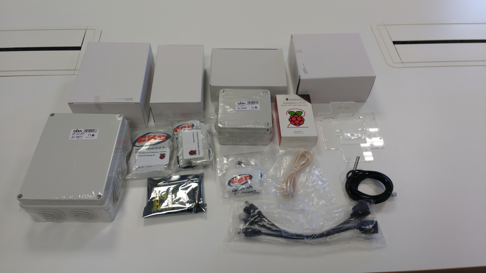
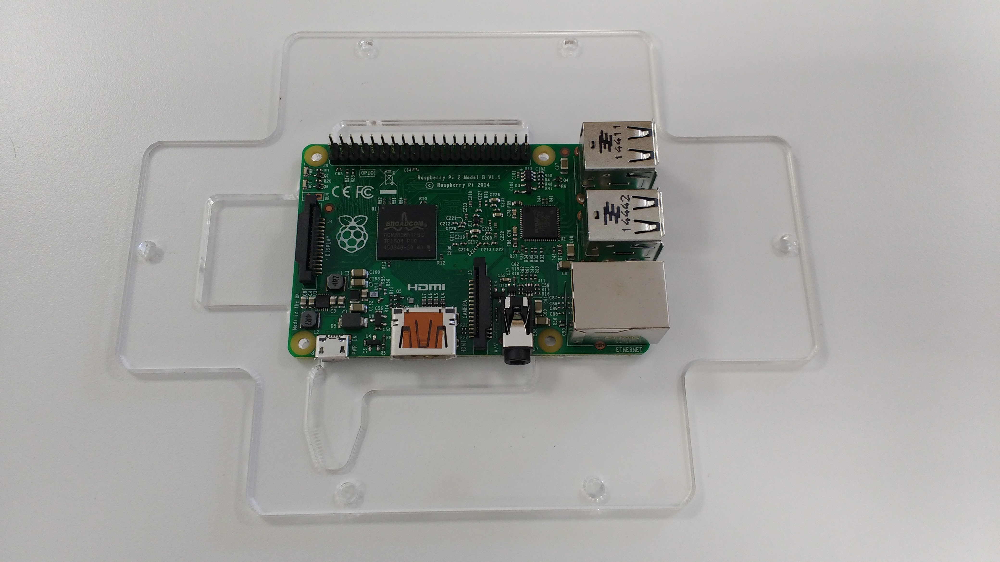
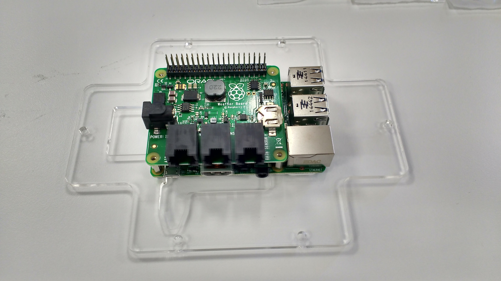
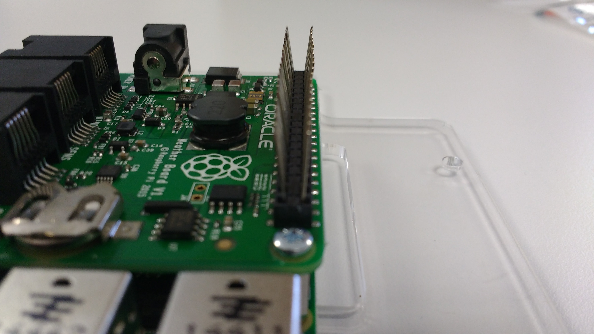

# Building your Weather Station Part I
## Setting up the Weather Station HAT

1. Your Raspberry Pi Weather Station should arrive in a sleeved box.

   

1. Open the box and remove its contents.

   

1. Remove the Raspberry Pi from its box and place in onto its acrylic base as shown below.

   

1. Remove the contents of board mounting kit.

   

1. Use the four 8mm fixing screws and the four hex spacers to affix the Raspberry Pi to its acrylic base. Then place the CN19895 receptacle over the Raspberry Pi's GPIO pins.

   

1. Next take the connected weather board and air sensor board.

   

1. Use a pair of pliers to separate the two boards.

   

1. Take the coin cell battery and insert it into the weather board.

   
   

1. You can now place the weather board over the Raspberry Pi, making sure that the mount on the weather board aligns with the pins of the CN19895 receptacle.

   

1. Use the four 6mm fixing screws to secure the weather board to the Raspberry Pi.

   

1. Use a credit card placed between the pins on the receptacle to angle each row of pins outwards a little, to ensure a good contact is made.

   
   

## Powering up the Pi

1. You can now plug a keyboard, mouse, Ethernet cable, and HDMI cable into the Raspberry Pi.

   

1. To power your Raspberry Pi, you could use a standard 5V power supply or the power over Ethernet (PoE) kit, which is included.

   

1. Connect an Ethernet cable (not included) to the two PoE adaptors. Plug the power supply into the appropriate adaptor.

   

1. One adaptor plugs into the Raspberry Pi as shown below. The other end can be connected to a network point and a wall socket.

   

## What Next

1. You can now proceed to the [Software Setup](software.md), or if you prefer, you can continue to [Building your Weather Station Part II](build2.md).
