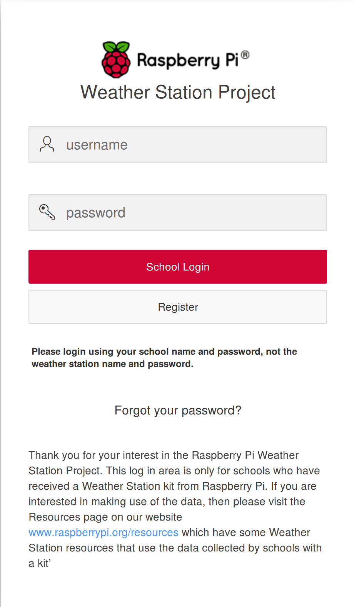
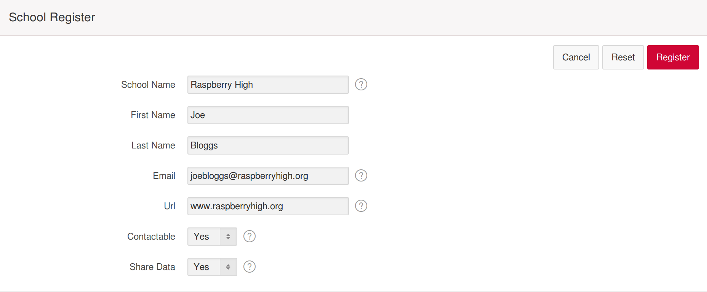
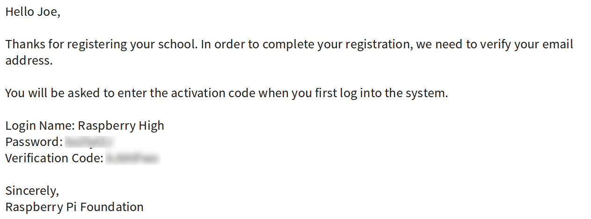
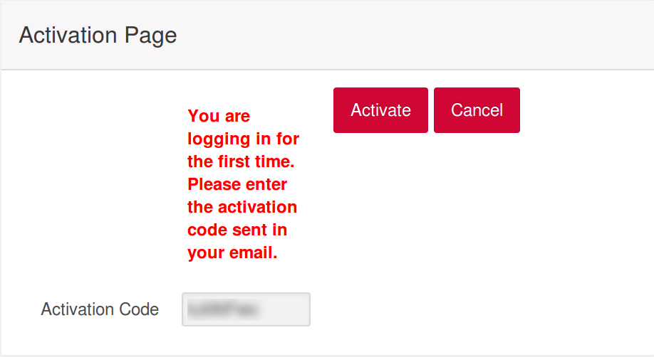
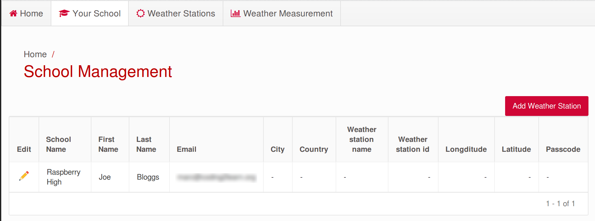
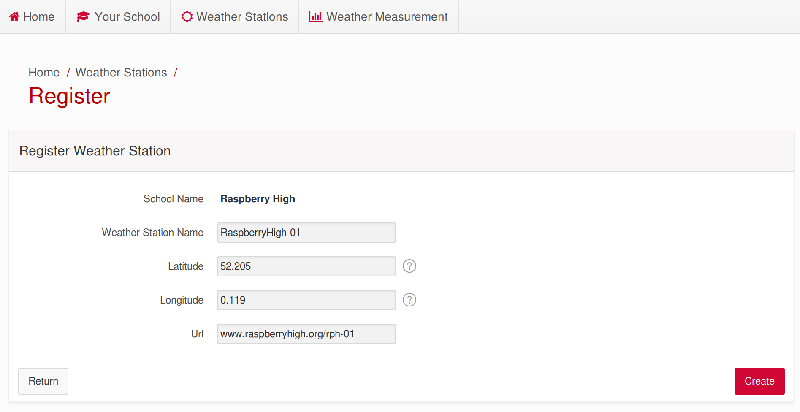

# Registering your Weather Station

If you have received a Raspberry Pi Weather Station, then your first task will be to register your school and Weather Station on the Raspberry Pi Oracle Database.

## Registering your School

1. Navigate to the [Raspberry Pi Oracle Database](https://apex.oracle.com/pls/apex/f?p=81290:LOGIN_DESKTOP:0:::::&tz=1:00), and click on the **Register** button.
   

1. Now fill in your details, including your organisation's web address (URL) and whether you permit the Raspberry Pi Foundation to contact you.
   

1. You may have to wait up to 24 hours for your registration to go through. Once you have been registered on the database, you will receive an email from us (so keep checking your spam folder, just in case).
   

1. Now go back to the [Raspberry Pi Oracle Database](https://apex.oracle.com/pls/apex/f?p=81290:LOGIN_DESKTOP:0:::::&tz=1:00) and fill in your school's name and password.
   

1. The next page will ask for your activation code, which is the verification code sent to you in the email.
   

1. Once you click on **Activate**, you will be taken to your Dashboard page.
   

## Register your Weather Station

1. Click on **Your School** on your dashboard.

1. You will be taken to your school's data page. To create a new Weather Station, click on **Add Weather Station**.
   

1. You now need to complete the details for your Weather Station. You can choose any name you like, although it is probably best to keep it fairly short.
   

1. Longitude and latitude are used to identify the location of your Weather Station. Latitude specifies the north–south position of a point on the Earth's surface. Longitude specifies the east-west position of a point on the Earth's surface. To find your longitude and latitude, if you don't already know it, you can use Google Maps. Clicking on your location on Google Maps will reveal your longitude and latitude at the bottom of the screen. The first number is your latitude and the second is your longitude.
   

1. Once you have completed all the fields and clicked on **Create**, the next screen will now show your Weather Station. You should make a note of the passcode as you will need this when it comes to setting up your Weather Station.

1. You will now see your weather wtation displayed on the **Your School** tab. The data shown will include your weather stations's passcode, which you will need when you set up the software.

## What Next?

1. Now that your weather station has been registered, you can proceed to setting up all the hardware with our [Hardware Guide](build.md).
