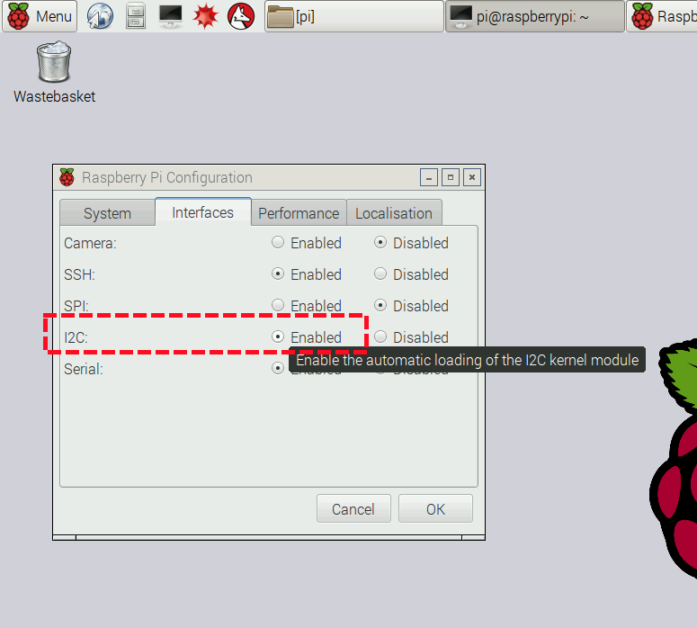
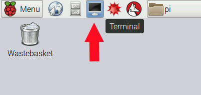

Software Set-up
==============
You can download our weather station disk image and write it to an SD card or you can follow the manual installation below. We recommend using the disk image.

#Using our weather station disk image

1.	[Download the disk image](LINK) and follow the instructions for writing it to an SD card.
2.	Put the SD card into the Raspberry Pi in your weather station and boot it up.
3.	Skip to the **Testing the Sensors** section below and test that the weather station and all sensors are working.
4.	Go to [Database Set-up](database-setup.md)

#Manual installation
Alternatively you can follow the steps below. You do not need any prior knowledge but it is more technical than using the disk image. The benefit of doing the tutorial is that you will learn about the workings of the sensors and the station as you do it. 


Mundane but important stuff
------------------------------

1.  Start with a fresh install of the latest version of [Raspbian](https://www.raspberrypi.org/downloads/raspbian/).
1.  When booting for the first time, you will be presented with the desktop.
2.  From the Menu button top left choose Preferences -> Raspberry Pi Configuration
3.  Select "**Expand Filesystem**":

    
1. While you're here we recommend that you **change your password** using the button underneath.   
1. In the Interfaces tab enable I2C:

    
    
1. A reboot dialogue will appear. Select "Yes". 


Setting up the Real Time Clock
--------------------------------
We'll be doing most of the work from the command line. Open a terminal window using the icon on the menu bar to access this:

    

You'll now be at a prompt 
```
{.bash}pi@raspberrypi: ~ $
```
where you can type in the commands following.

1. First you'll need to download the necessary files: 

``` {.bash}
cd ~ && git clone https://github.com/raspberrypi/weather-station
```
We've included an install script to set up the Real Time Clock automatically. You can run this file or, alternatively, follow the instructions below to set up the RTC up manually. We recommend using the install script!

##Automatic set-up

1. To run the script:

    ```bash
    ./weather-station/install.sh
    ```

**This will take some time** so please be patient. At some point it will ask you to confirm or set the time. When finished it will reboot automatically.

3.	Skip to the **Testing the Sensors** section below and test that the weather station and all sensors are working.
4.	Go to [Database Set-up](database-setup.md)


##Manual set-up
1.  First you want to make sure you have all the latest updates for your
    Raspberry Pi.

    ``` {.bash}
    sudo apt-get update && sudo apt-get upgrade
    ```

1.  You now need make some changes to a config file to allow the
    Raspberry Pi to use the real-time clock.

    ``` {.bash}
    sudo nano /boot/config.txt
    ```

Add the following lines to the bottom of the file:

    ``` {.bash}
    dtoverlay=w1-gpio
    dtoverlay=pcf8523-rtc
    ```

Press \`Ctrl - O\` then \`Enter\` to save and \`Ctrl - X\` to quit nano.

Now set the required modules to load automatically on boot.

    ``` {.bash}
    sudo nano /etc/modules
    ```

Add the following lines to the bottom of the file:

    ``` {.bash}
    i2c-dev
    w1-therm
    ```

Press \`Ctrl - O\` then \`Enter\` to save and \`Ctrl - X\` to quit nano.

1.  For the next steps we need the Weather Station hat to be connected
    to the Raspberry Pi.

    ``` {.bash}
    sudo halt
    ```

1.  Reboot for the changes to take effect.

    ``` {.bash}
    sudo reboot
    ```

1.  Check that the Real Time Clock (RTC) appears in \`/dev\`

    ``` {.bash}
    ls /dev/rtc*
    ```

Expected result: `/dev/rtc0`

### Initialise the RTC with the correct time

Use the \`date\` command to check the current system time is correct. If
correct then you can set the RTC time from the system clock with the
following command:

    ``` {.bash}
    sudo hwclock -w
    ```

If not then you can set the RTC time manually using the command below
(you'll need to change the \`--date\` parameter, this example will set
the date to the 1st of January 2014 at midnight):

   ``` {.bash}
    sudo hwclock --set --date="yyyy-mm-dd hh:mm:ss" --utc
   ```

for example:

    ``` {.bash}
    sudo hwclock --set --date="2015-08-24 18:32:00" --utc
    ```

Then set the system clock from the RTC time

``` {.bash}
sudo hwclock -s
```

1.  Enable setting the system clock automatically at boot time. First
    edit the hwclock udev rule:

    ``` {.bash}
    sudo nano /lib/udev/hwclock-set
    ```

Find the lines at the bottom that read:

    ``` {.bash}
    if [ yes = "$BADYEAR" ] ; then
        /sbin/hwclock --rtc=$dev --systz --badyear
    else
        /sbin/hwclock --rtc=$dev --systz
    fi
    ```

Change the \`--systz\` options to \`--hctosys\` so that they read:

    ``` {.bash}
    if [ yes = "$BADYEAR" ] ; then
        /sbin/hwclock --rtc=$dev --hctosys --badyear
    else
        /sbin/hwclock --rtc=$dev --hctosys
    fi
    ```

Press `Ctrl - O` then `Enter` to save and `Ctrl - X` to quit nano.

### Remove the fake hardware clock package

    ``` {.bash}
    sudo update-rc.d fake-hwclock remove
    sudo apt-get remove fake-hwclock -y
    ```


### Install the necessary software packages

    ``` {.bash}
    sudo apt-get install i2c-tools python-smbus telnet -y
    ```

Testing the sensors
-------------------


1.  Power up your Raspberry Pi and login.

2.  Test that the I²C devices are online and working.

``` {.bash}
sudo i2cdetect -y 1
```

Expected output:

```
	 0  1  2  3  4  5  6  7  8  9  a  b  c  d  e  f
00:          -- -- -- -- -- -- -- -- -- -- -- -- -- 
10: -- -- -- -- -- -- -- -- -- -- -- -- -- -- -- -- 
20: -- -- -- -- -- -- -- -- -- -- -- -- -- -- -- -- 
30: -- -- -- -- -- -- -- -- -- -- -- -- -- -- -- -- 
40: 40 -- -- -- -- -- -- -- -- -- -- -- -- -- -- -- 
50: -- -- -- -- -- -- -- -- -- -- -- -- -- -- -- -- 
60: -- -- -- -- -- -- -- -- UU 69 6a -- -- -- -- -- 
70: -- -- -- -- -- -- -- 77                         
```

- `40` = HTU21D. Humidity and temperature sensor.
- `77` = BMP180. Barometric pressure sensor.
- `68` = PCF8523. Real Time Clock, it will show as `UU` because it's reserved by the driver.
- `69` = MCP3427. Analogue to Digital Converter on main board.
- `6a` = MCP3427. Analogue to Digital Converter on snap off AIR board.

Note: `40`, `77` and `6a` will only show if you have connected the **AIR** board to the main board.

