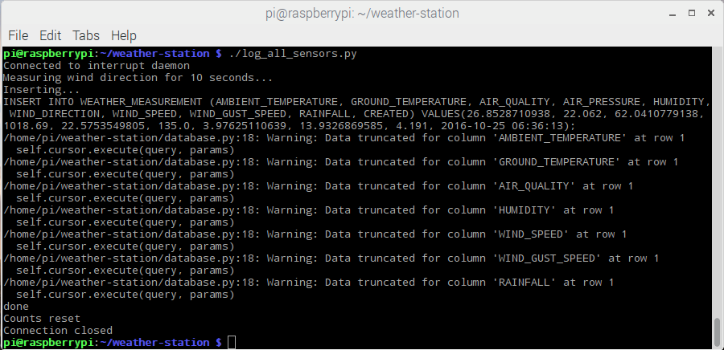

# Testing your Weather Station

With all your sensors connected, it's a good idea to test that your weather station is recording data and able to upload it to the database.

## Manipulate and measure the sensors
1. The anemometer and rain gauge can be manipulated as neither will be recording data unless they are physically moved. Spinning the anemometer and tilting the rain gauge back and forth a few times while the next set of instructions are followed will result in some data being logged. 

1. Open up a terminal window (`ctrl + alt + t`) and then change into the `weather-station` directory:

```bash
cd weather-station
```

1. To start the logging of sensor data, type the following into the terminal window:

```bash
./log_all_sensors.py
```

1. You should see output as shown in the screen capture below.



1. Do not worry about the `Data truncated` warnings. The sensors measure to an unrealistic number of significant figures, so these values are truncated before they are added to the database.

## Upload to Oracle

1. The next step is to test that the software is capable of uploading the data to the online Oracle Database. To test this, type the following into the terminal:

```bash
sudo ./upload_to_oracle
```

1. You should see output as shown the screen capture below.


1. Each `Response status: 201` message means that a row of the local database on your Raspberry Pi was uploaded to the Oracle database. If you receive a different response code, then check that your Raspberry Pi is connected to the network and that it is capable of communicating through any firewalls or proxy servers your network may be using.

## Checking the online database

1. In your web browser, navigate to the [Oracle Database](https://apex.oracle.com/pls/apex/f?p=81290:LOGIN_DESKTOP:0:::::&tz=1:00) and log in:


1. On your dashboard, click on Weather Measurements to view the latest measurements from your Weather Station.


1. It is worth having a play around with the filters and the download options with your data, to see what can be achieved.

## What Next?

Now that you have tested your Weather Station, close up the boxes and ensure the grommets are in place. You can then proceed to the next section, and learn how to [install the Weather Station at your school](siting.md).
